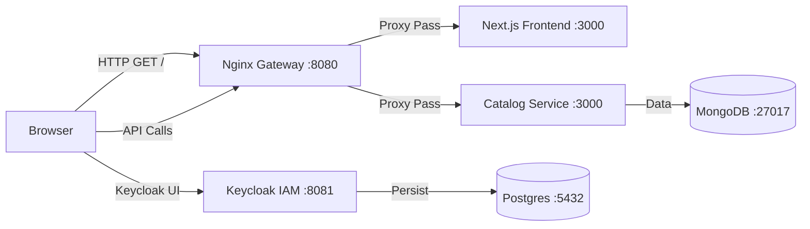
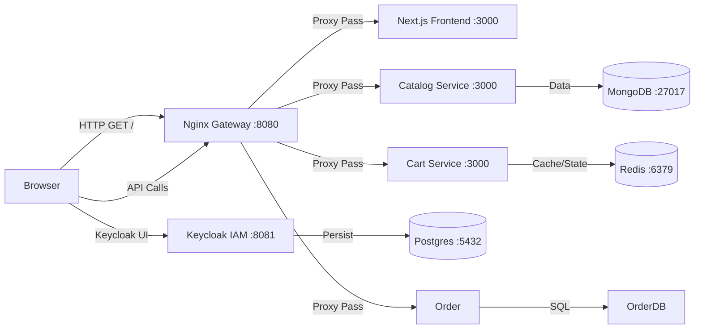
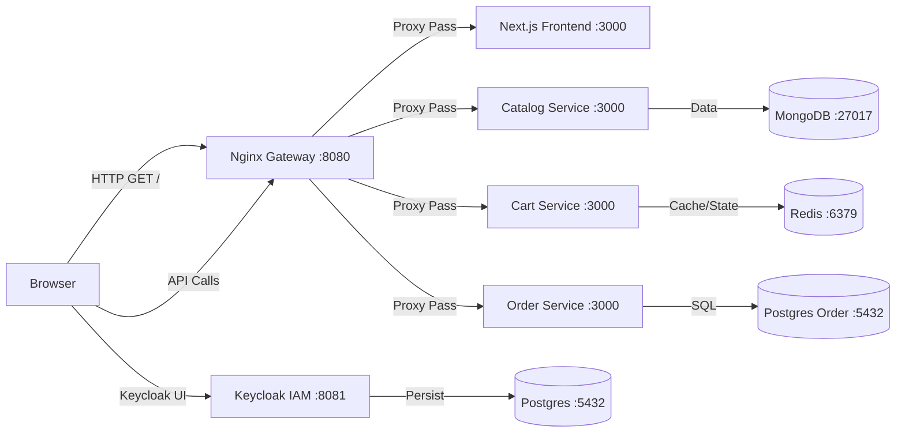

# PoC Walkthrough: Murugan Online Retail Platform

## Overview
This Proof of Concept (PoC) demonstrates the **Microservices** and **API Gateway** pattern designed in the architecture.

**Components:**
1.  **API Gateway (Nginx)**: Listens on port `8080`. Routes traffic to services.
2.  **Catalog Service (Node.js)**: Runs internally on port `3000`. Returns mock product data.

## Prerequisites
- Docker & Docker Compose installed and running.

## How to Run
1.  Open a terminal in the project root (`d:\murugan_online-retail-platform`).
2.  Run the following command to build and start the services:
    ```powershell
    docker-compose up --build
    ```

## Verification Steps
Once the services are running, verify the flow:

### 1. Test via API Gateway
Open your browser or use `curl` to access the Catalog Service through the Gateway:

**URL**: `http://localhost:8080/api/v1/catalog`

**Expected Output:**
The response should now include a `count` field and data fetched from MongoDB.
```json
{
  "service": "Catalog Service",
  "status": "Active",
  "count": 3,
  "products": [
    { "name": "Smartphone X", "price": 999, ... },
    ...
  ]
}
```

### 3. Verify Frontend
1.  Open your browser to: `http://localhost:8080/`
2.  You should see the **Murugan Retail Store** homepage.
3.  It should display the products fetched from the backend (seeded data).

### 4. Verify Persistence
1.  **Stop containers**: `docker-compose down`
2.  **Start again**: `docker-compose up`
3.  **Check API**: The data should still be there (persisted in the `mongo_data` volume).

### 5. Verify Identity Service (Keycloak)
1.  Wait for a minute for Keycloak to start (it performs DB migrations on first run).
2.  Open **Keycloak Admin Console**: `http://localhost:8081/`
3.  Click **Administration Console**.
4.  Login with:
    - **Username**: `admin`
    - **Password**: `admin`
5.  You should see the Keycloak dashboard. This confirms the Identity Infrastructure is running.

## Architecture Diagram of PoC


### 6. Verify Cart Service (Redis)
1.  **Add Item to Cart** (via curl or Postman):
    ```bash
    curl -X POST http://localhost:8080/api/v1/cart/user123 \
      -H "Content-Type: application/json" \
      -d '{"productId": "prod_1", "quantity": 2}'
    ```
2.  **Get Cart**:
    ```bash
    curl http://localhost:8080/api/v1/cart/user123
    ```
    **Expected Output**:
    ```json
    {
      "userId": "user123",
      "cart": {
        "prod_1": 2
      }
    }
    ```

## Architecture Diagram of PoC


### 7. Verify Order Service (Postgres)
1.  **Create Order**:
    ```bash
    curl -X POST http://localhost:8080/api/v1/orders \
      -H "Content-Type: application/json" \
      -d '{"userId": "user123", "totalAmount": 199.99, "items": [{"id": "prod_1", "qty": 1}]}'
    ```
    **Expected Output**:
    ```json
    {
      "id": 1,
      "user_id": "user123",
      "status": "PENDING",
      ...
    }
    ```
2.  **Get Orders**:
    ```bash
    curl http://localhost:8080/api/v1/orders/user123
    ```

## Architecture Diagram of PoC


### 8. Verify Frontend Flow (UI)
1.  Open [http://localhost:8080](http://localhost:8080) in your browser.
2.  Click **"Add to Cart"** on a product. You should see a success message.
3.  Click **"Go to Cart"** (top right).
4.  Verify the item is listed.
5.  Click **"Checkout (Place Order)"**.
6.  You should see "Order Placed Successfully!".
7.  **Refresh the Page**. The cart should now be empty (this confirms the feature works).

